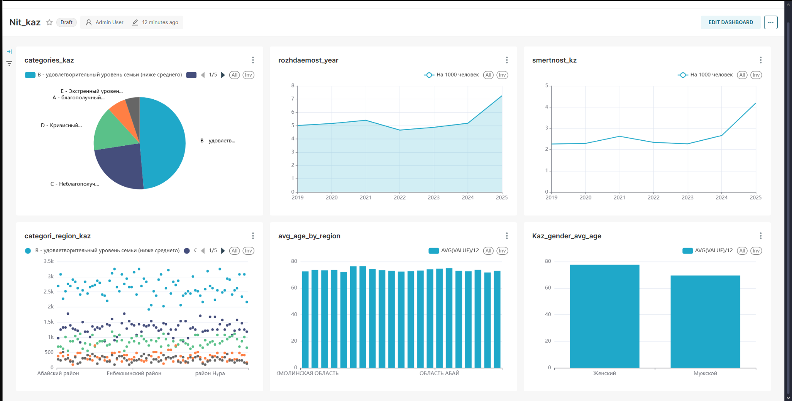

Вот README на английском, с описанием проекта, этапов пайплайна и структуры файлов:

---

# Airflow, DBT, Clickhouse, Superset

This project demonstrates a full modern data pipeline with synthetic demographic data. The process includes data generation, transformation, loading into different data warehouses, and dashboard visualization.

---

## Pipeline Overview

1. **Synthetic Data Generation**
   The script `synthesdata.py` generates **synthetic data from cks.csv** .

2. **PostgreSQL Storage**
   The raw synthetic data is saved into PostgreSQL.

3. **Transformation with DBT**
   DBT (Data Build Tool) is used to perform SQL transformations on top of PostgreSQL data.

4. **Loading into ClickHouse**
   Transformed data is extracted from PostgreSQL and loaded into ClickHouse using Apache Airflow.

5. **Visualization in Superset**
   Dashboards are built in Apache Superset on top of the ClickHouse data for exploration and analysis.

---

## Project Structure

```
nit_project/
├── dags/
│   ├── data_pipeline.py            
│   └── synthesdata.py             
│
├── data/                            # Input Excel files (NOT INCLUDED in repo)
│   ├── coefficient_rozhdaemosti.xlsx
│   ├── coefficient_smertnosti.xlsx
│   ├── estestvenniy_prirost_ubil_2024.xlsx
│   ├── migration_prirost_ubil.xlsx
│   ├── obshaya_chislennost_naseleniya.xlsx
│   └── sred_prodolzhitelnost_zhizni.xlsx
│
│
│── dbt_cks_test/
│
│
├── superset/
│   ├── docker-init.sh               
│   └── superset_config.py        
│
├── clickhouse-user.xml          
├── create_user.sh            
├── docker-compose.yml       
├── dockerfile                    
├── requirements.txt               
└── README.md                     
```

---


## Note on Data Files

The `/data/` folder contains **up to 6 Excel files** that are **not included in this repository** due to size and privacy concerns.

To run the project locally, place the required Excel files in the `data/` folder following the naming conventions shown above.

